# txt2video

Generating videos, conditioned on text with GANs. Honours thesis. This implementation contains the following paper implementations:

1. To Create What You Tell
2. TGAN
3. TGANv2

With modifications to the last two to condition on text. Text is encoded with a Bi-LSTM which has been pretrained to generate the next token - which from memmory is the same methodlogy as "To Create What You Tell".

Additionally to capture motion in the discriminator more effectively, non-local blocks are utilised (self attention).

Conditional information is introduced similar to StackGAN++. [Relativisitc losses are used](https://github.com/AlexiaJM/RelativisticGAN).

For discriminator we compare the pairs:
- ${(x_r, c_r), (x_f, c_r)}$
- ${(x_r, c_f), (x_f, c_r)}$ 

For generator we only compare first pair above.
- x_r is real video
- x_f is fake video
- c_r is caption correctly associated to video
- c_f is caption not associated to video

Standard GAN loss is preferred due to 1 discrim step to 1 generator step.

Alternatively I did experiment with non-relativisitc loss, via the following intiution:
- $(x_r, c_r)$ => [should be associated]
- $(x_f, c_r)$ => [should not be]
- $(x_r, c_f)$ => [should not be]
- $(x_f, c_f)$ => not used

The last could optionally be used to learn but doesn't seem to be necessary (at least emprically)

# Datasets & Results

Three datasets are used.

1. Synthetic MNIST for moving digits
2. MSR Video to Text (MSRVDC) dataset
3. Custom dataset with videos scraped from reddit

## Synthetic MNIST

MNIST with generated data from `txt2vid/data/synthetic/generate.py`

### TCWYT Baseline:

From top to bottom: 

`'<start> digit 9 is left and right<end>'`

`'<start> digit 8 is right and left<end>'`
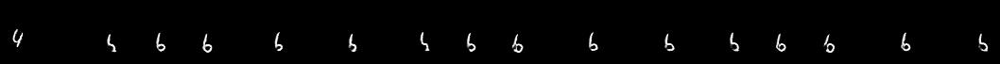

`'<start> digit 8 is bottom and top<end>'`
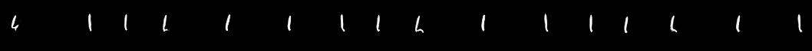

`'<start> digit 4 is top and bottom<end>'`
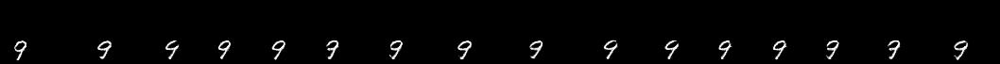

## MSRVDC

### TCWYT (Conditional)

Bottom is ground truth for both of below

`<start> a woman is saying about how to make vegetable tofu <unk> <end>'`

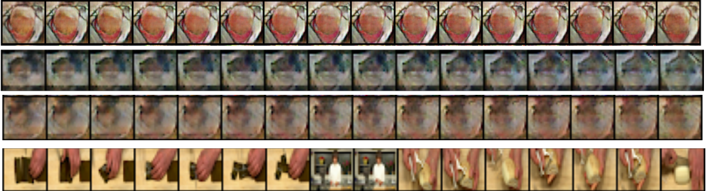

`<start> the person is cooking <end>'`

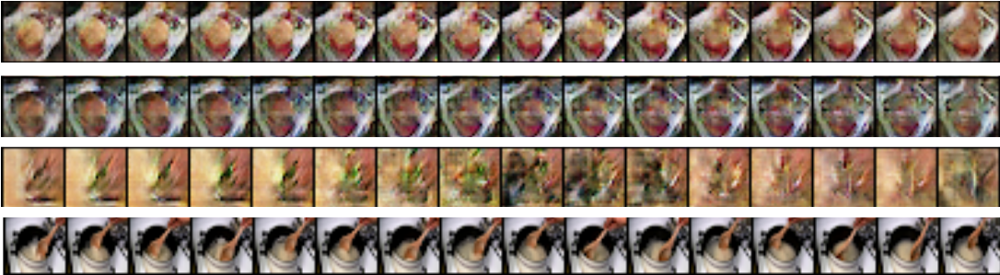

### TGANv2 (Unconditional)

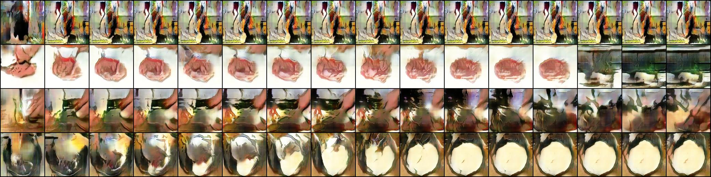
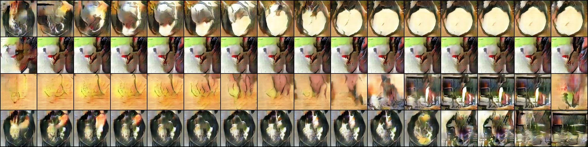
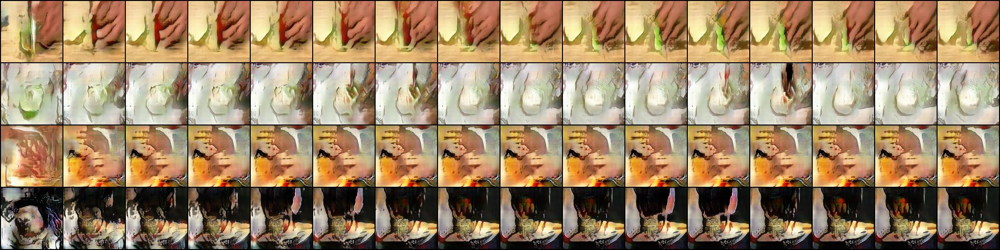

### TGANv2 (Conditional) + My Modifications

`'<start> the man poured preserves over the chicken<end>'`
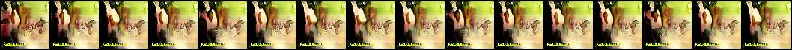

`'<start> a person is dicing and onion<end>'`
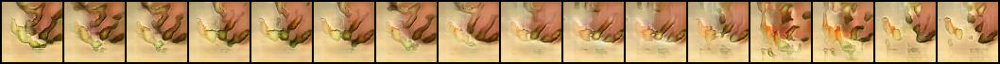

`'<start> a woman is peeling a large shrimp in a glass bowl of water<end>'`
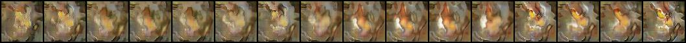

## reddit-videos

See https://github.com/miguelmartin75/reddit-videos

Didn't end up training on this dataset :/

# Details & References

Please see thesis.pdf for more details, references, etc.
